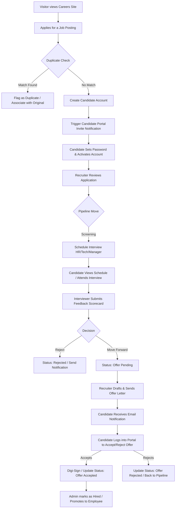

# Project Overview: Enterprise Recruitment & Applicant Tracking System (ATS)

This document provides a comprehensive overview of the Enterprise Recruitment and Applicant Tracking System (ATS). It is designed to explain the system's core purpose, business logic, feature sets, user roles, technical components, and folder structures.

---

## 1. Project Purpose & Business Problem

### Core Purpose
The Enterprise Recruitment System is a modern, web-based Applicant Tracking System (ATS) and Human Resource Management (HRM) portal designed to streamline the hiring process from job posting creation to candidate onboarding. It offers a structured pipeline for tracking applicants, scheduling interviews, gathering panel feedback, extending offers, and facilitating candidate self-service.

### Business Problems Solved
- **Fragmented Recruiting Processes**: Centralizes communications, job applications, interview schedules, and notes in a single platform, eliminating siloed spreadsheet tracking.
- **Poor Candidate Experience**: Provides candidates with a dedicated self-service portal (`/portal`) where they can view application status, upload documents, schedule interviews, and accept/reject job offers.
- **Unstructured Interview Feedback**: Organizes panel interviewing with structured feedback templates and scoring metrics directly linked to candidates' profiles.
- **Manual Offer Management**: Automates the generation and digital signature of offer letters, tracking versions, proposed compensations, joining dates, and signing IP addresses.
- **Duplicated Candidates**: Employs duplicate detection to flag matching candidate information (name, email, phone) to avoid parallel processing by multiple recruiters.

---

## 2. Key Features

- **Public Careers Portal (`/careers`)**:
  - Filterable Job Board by department, location, employment type, arrangement, and experience level.
  - Custom application forms with document attachments (Resume, Cover Letter, Photograph) and dynamic screening questions.
- **Candidate Portal (`/portal`)**:
  - Secure authentication via specialized `candidate` guard using email/password.
  - Interactive dashboard showing active applications, pipelines, and upcoming interviews.
  - Document management hub for supporting documents.
  - Offer letter response center (digital signatures, accepting, or rejecting).
- **Admin Panel (`/admin`) via Filament PHP**:
  - **Job Posting Management**: Status workflows (draft, published, closed, archived), department assignments, location setups, custom screening questions, and recruiter assignments.
  - **Application Management**: Drag-and-drop-style pipeline transitions, grading (1-5 stars), recruiter assignment, internal notes, activity log.
  - **Interview Management**: Multiple rounds (HR, Technical, Manager, Cultural, Panel), scheduling (date, time, duration), meeting platforms (Zoom, Meet, Teams), and automated calendar invitations.
  - **Offer Management**: Draft, send, track, and archive offer letters with detailed compensation breakdown (basic salary, housing, transport, medical allowances, and CTC calculations).
  - **User & Access Management**: Role-based access control (RBAC) via Spatie Laravel Permission.

---

## 3. User Roles & Permissions

1. **Candidate (Guest/Authenticated Candidate)**:
   - Browse jobs, submit applications.
   - Complete profile, upload documents.
   - Review interview schedules and respond to offer letters.
2. **Recruiter (Admin User)**:
   - Create/manage job postings and screening questions.
   - Screen applicants, move candidates through the pipeline, rate applicants, add internal notes.
   - Schedule interviews and review feedback.
   - Initiate offer letter drafts.
3. **Hiring Manager (Admin User)**:
   - Approve job postings and offer requests.
   - Conduct interviews and submit detailed scorecards.
   - Move applicants to final selection.
4. **Administrator (Super Admin User)**:
   - Full control over system configurations, roles, permissions, audit logs (activity logs), locations, and departments.

---

## 4. Complete System Workflow

---

## 5. Technology Stack & Core Packages

### Frameworks & Libraries
- **PHP**: `^8.3`
- **Laravel Framework**: `^12.0` (Core MVC structure, Eloquent ORM, Routing, Blade, Queues, Notifications)
- **Livewire**: `^3.5` (Interactive SPA-like backend behaviors)
- **Filament PHP**: `^3.2` (TALL stack dashboard generation engine)

### Primary Composer Packages
- `spatie/laravel-permission`: Role-based access control.
- `spatie/laravel-activitylog`: Database action auditing.
- `spatie/laravel-medialibrary`: Document and image attachment management.
- `barryvdh/laravel-dompdf`: PDF generation for offer letters.
- `maatwebsite/excel`: Exporting applications and metrics to spreadsheets.
- `laravel/telescope` & `laravel/horizon`: Monitoring, debugging, and Redis queue management.

---

## 6. Directory Structure at a Glance

- **`/app`**: Core application logic.
  - `/Events` & `/Listeners`: Async status changes and portal invites.
  - `/Filament`: Admin dashboard resources, pages, widgets.
  - `/Http`: Controllers, Middleware, Request validation.
  - `/Mail` & `/Notifications`: Communication layers (Transactional emails).
  - `/Models`: Database entities, scopes, and relationships.
  - `/Policies`: Model-level authorization gates.
  - `/Services`: Core business logic engines separated by module.
- **`/config`**: Configuration files (auth, recruitment, etc.).
- **`/database`**: Database migrations, seeders, and factories.
- **`/resources`**: Blade templates, layouts, raw assets.
- **`/routes`**: Web routes (`web.php`) and candidate portal routes (`candidate.php`).
