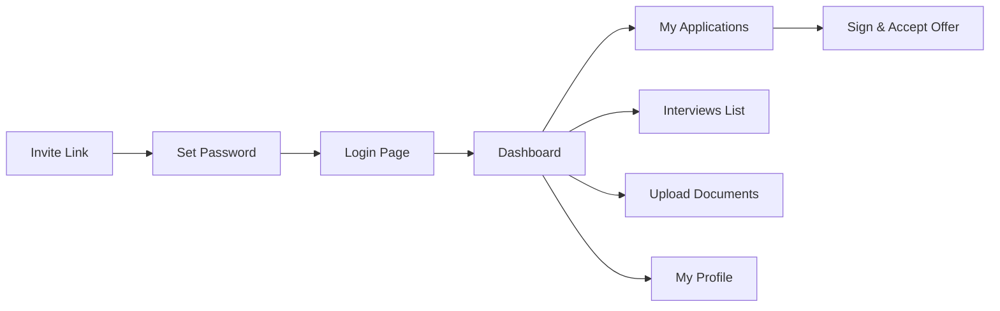

# Frontend Architecture

This document describes the design, layout system, styles, pages, components, and interaction patterns of the client-facing parts of the recruitment application.

---

## 1. Structure Overview

The frontend is divided into two distinct frontend zones, both built using **Laravel Blade Templates** styled with **Tailwind CSS (CDN-based)**:

```
resources/views/
├── layouts/
│   ├── careers.blade.php        # Layout for the public Careers site
│   └── portal.blade.php         # Layout for the Candidate Portal
├── careers/
│   ├── index.blade.php          # Careers home page
│   ├── jobs/
│   │   ├── index.blade.php      # Job listings board
│   │   └── show.blade.php       # Job details view
│   └── applications/
│       ├── create.blade.php     # Application submission form
│       └── thank-you.blade.php  # Confirmation page
└── portal/
    ├── dashboard.blade.php      # Candidate portal landing dashboard
    ├── auth/
    │   ├── login.blade.php      # Login form
    │   ├── set-password.blade.php  # Initial password setup
    │   ├── forgot-password.blade.php
    │   └── reset-password.blade.php
    ├── applications/
    │   ├── index.blade.php      # List of applications
    │   └── show.blade.php       # Details & offer response portal
    ├── documents/
    │   └── index.blade.php      # Document management center
    ├── interviews/
    │   └── index.blade.php      # Interview schedules view
    └── profile/
        └── edit.blade.php       # Profile editing dashboard
```

---

## 2. Layouts & Assets

### Tailwind CSS Integration
Rather than compiling CSS locally via Webpack or Vite, the application utilizes a **CDN-based Tailwind CSS** configuration for extreme agility and lower asset footprint:
```html
<script src="https://cdn.tailwindcss.com"></script>
```
Theme configurations, custom fonts, color palettes (specifically the `primary` and `brand` teal palette), and custom keyframes are injected via standard JavaScript tailwind configurations directly inside the `<head>` of both `careers.blade.php` and `portal.blade.php`.

### Layout Customizations
- **Google Fonts**: Both layouts embed the **Inter** typeface family.
- **Glassmorphism & Gradients**: Specialized classes such as `.glass-card` (blur and background opacity) and `.gradient-bg` / `.gradient-hero` (linear transitions of brand colors) are pre-defined in the layout style blocks.

---

## 3. UI and Form Workflows

### Public Careers Application Form
Located in `careers/applications/create.blade.php`, this form is a complex multi-section container:
1. **Personal Information**: Fields for Name, Email, Phone, Social Profiles, Address.
2. **Professional Profile**: Current Company, Current Salary, Expected Salary, Notice Period, Resume & Photograph Uploads.
3. **Education History Grid**: Dynamic repeatable grid allowing candidates to input multiple degree entries.
4. **Work Experience Grid**: Dynamic repeatable grid allowing candidates to input multiple company histories.
5. **Screening Questions**: Rendered dynamically based on the Job Posting's configured active questions.

### Dynamic repeatable forms
Repeatable items (Education and Experience rows) are handled via Vanilla JavaScript in the Blade template. Buttons (like "Add Education" or "Add Experience") trigger template-cloning which updates input name attributes with incrementing indexes (e.g. `education[0][degree_name]`, `education[1][degree_name]`).

---

## 4. Navigation Flow Diagrams

### Careers Website Navigation
```mermaid
graph LR
    Home[Careers Home /] --> Listings[Open Positions /jobs]
    Listings --> JobDetail[Job Detail /jobs/{slug}]
    JobDetail --> Apply[Apply Form /apply/{slug}]
    Apply --> Submit[Submit Post]
    Submit --> ThankYou[Thank You Page /thank-you/{app}]
```

### Candidate Portal Navigation

