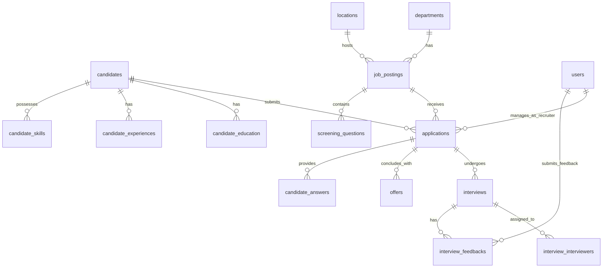

# Database Architecture & Schema Reference

This document covers the recruitment system database schema. It lists the core database tables, migrations, relationship mappings, index listings, and includes a comprehensive ER diagram.

---

## 1. Migration History

Migrations are executed sequentially, establishing core configuration tables before building candidates, applications, scheduling, and finally auditing.

1. **System & Access**:
   - `create_users_table.php` -> Sets up admin accounts, password reset tokens, session tables.
   - `create_permission_tables.php` -> Spatie permissions schemas (roles, permissions, pivots).
2. **HR Metadata & Configurations**:
   - `create_departments_table.php` -> Corporate departments.
   - `create_designations_table.php` -> Job titles per department.
   - `create_locations_table.php` -> Offices, remote configurations, branch mappings.
   - `create_skills_table.php` -> Directory of skills (technical, soft, etc.).
3. **Recruitment Base**:
   - `create_job_postings_table.php` -> Requisitions, requirements, and manager linkages.
   - `create_job_skills_table.php` -> Skills requirement pivot.
   - `create_screening_questions_table.php` -> Custom forms linked to requisitions.
4. **Candidate & Submissions**:
   - `create_candidates_table.php` -> Profile information, contact details, background parameters.
   - `add_auth_columns_to_candidates_table.php` -> Adds candidate portal login parameters (password, verified timestamp).
   - `create_applications_table.php` -> Tracks candidate submissions against job openings.
   - `create_candidate_answers_table.php` -> Custom screening questionnaire answers.
   - `create_candidate_education_table.php` / `create_candidate_experiences_table.php` / `create_candidate_skills_table.php` -> Profile structures.
5. **Interview & Feedback Loop**:
   - `create_interviews_table.php` -> Schedules, zoom details, mode structures.
   - `create_interview_interviewers_table.php` -> Panel assignment mapping pivot.
   - `create_interview_feedbacks_table.php` -> Interviewer scorecards and recommendations.
6. **Offer Letters & Activity Logs**:
   - `create_offers_table.php` -> Detailed compensation figures, expiry dates, and digital signature records.
   - `create_application_activities_table.php` -> Specific event logs.
   - `create_application_status_history_table.php` -> Audit of pipeline states.
   - `create_documents_table.php` -> Morphic document attachments.
   - `create_email_logs_table.php` -> Email transaction ledger.
   - `create_talent_pools_table.php` -> Custom talent pool lists.
   - `create_recruitment_sources_table.php` -> Referral and campaign trackers.
   - `create_activity_log_table.php` / `create_notifications_table.php` -> System actions and database alerts.

---

## 2. Core Tables Schema

### `candidates` Table
- `id` (PK, bigint)
- `candidate_number` (string, unique)
- `first_name` (string)
- `last_name` (string)
- `email` (string)
- `password` (string, nullable)
- `phone` (string)
- `current_company` (string, nullable)
- `current_designation` (string, nullable)
- `expected_salary` (decimal, nullable)
- `resume_path` (string, nullable)
- `blacklist_status` (enum: none, blacklisted, whitelisted)

### `applications` Table
- `id` (PK, bigint)
- `application_number` (string, unique)
- `candidate_id` (FK to candidates)
- `job_posting_id` (FK to job_postings)
- `recruiter_id` (FK to users, nullable)
- `status` (enum: new, screening, shortlisted, technical_interview, manager_interview, final_interview, offer_pending, offer_sent, offer_accepted, offer_rejected, hired, rejected, withdrawn, on_hold)
- `rejection_reason` (enum: underqualified, overqualified, etc., nullable)
- `rating` (integer, nullable)

### `interviews` Table
- `id` (PK, bigint)
- `application_id` (FK to applications)
- `candidate_id` (FK to candidates)
- `job_posting_id` (FK to job_postings)
- `round_type` (enum: hr_screening, technical, manager, cultural, final, panel)
- `round_number` (integer)
- `mode` (enum: in_person, video_call, phone)
- `scheduled_date` (date)
- `start_time` (time)
- `end_time` (time)
- `status` (enum: scheduled, confirmed, in_progress, completed, cancelled, no_show, rescheduled)

### `offers` Table
- `id` (PK, bigint)
- `offer_number` (string, unique)
- `application_id` (FK to applications)
- `candidate_id` (FK to candidates)
- `job_posting_id` (FK to job_postings)
- `status` (enum: draft, sent, accepted, rejected, expired, negotiating, withdrawn)
- `total_ctc` (decimal)
- `joining_date` (date)
- `offer_expiry_date` (date)
- `digital_signature` (string, nullable)
- `signed_at` (timestamp, nullable)

---

## 3. Relationships ER Diagram

