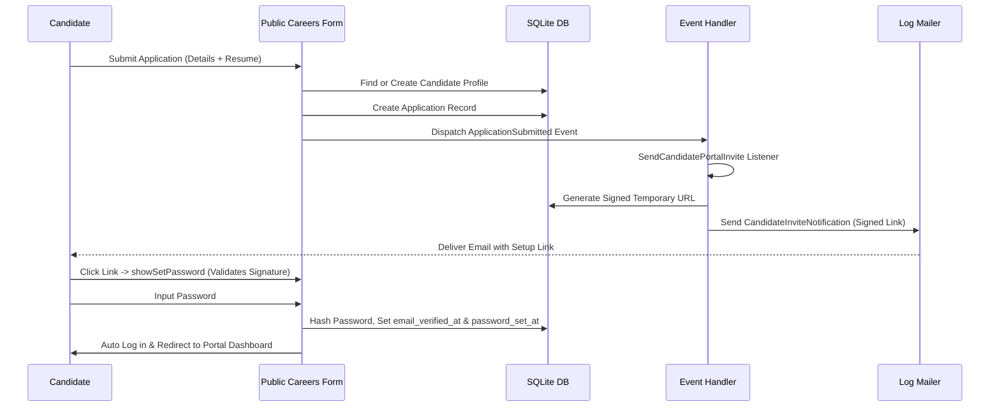

# Authentication & Authorization

This document covers the authentication systems, registration invite cycles, user guards, role permissions, and access configurations.

---

## 1. Multiple Guards Architecture

The system utilizes two distinct authentication environments, separating internal company workers (Admins, Recruiters, Hiring Managers) from external candidates.

```
                  ┌───────────────────────────────┐
                  │        HTTP Request           │
                  └───────────────┬───────────────┘
                                  │
                   Route prefix matches /portal?
                   /              \
                 YES               NO
                 /                   \
   ┌────────────▼─────────────┐ ┌─────▼────────────────────┐
   │ Guard: candidate         │ │ Guard: web (Default)     │
   │ Provider: candidates     │ │ Provider: users          │
   │ Model: App\Models\Candidate│ │ Model: App\Models\User │
   │ Table: candidates        │ │ Table: users             │
   └──────────────────────────┘ └──────────────────────────┘
```

These are configured in `config/auth.php` as follows:
- **`web` Guard**: Uses session driver backed by `App\Models\User` model.
- **`candidate` Guard**: Uses session driver backed by `App\Models\Candidate` model.

---

## 2. Candidate Onboarding & Password Setup Flow

To maintain high security and avoid spam accounts, candidates cannot self-register directly through an open form. Instead, candidate accounts are generated as a consequence of job application submissions:



### Signature Verification
The password setup URL contains a secure HMAC signature. If a candidate tampers with the parameters or accesses the link after expiry (default signature lifespan), the request is rejected with a signature mismatch error, and the candidate is redirected to the login page.

---

## 3. Internal User Roles & Spatie Permissions

For employees and system administrators, authorization is handled via **Spatie Laravel Permission**:

### Pre-defined Roles (Seeded via `RoleAndPermissionSeeder.php`)
1. **Super Admin**: Bypasses policy gates, allowing total system management.
2. **Recruiter**: Permitted to view, create, edit job postings; manage candidate pipelines; log feedback and ratings; schedule interviews; and draft offers.
3. **Hiring Manager**: Authorized to review assigned jobs, inspect applications, log interview scorecards, and request offer generations.

### Middleware Gating
- Candidate routes are protected using `Route::middleware('auth:candidate')`.
- Employee routes and panels are restricted via Filament's panel middleware, which queries the `User` model's `canAccessPanel` method to check if the user is active and has correct administrative roles.
- Model-level operations (like moving application stages or reading private notes) are authorization-checked using corresponding Policy classes (`App\Policies\ApplicationPolicy`, etc.).
